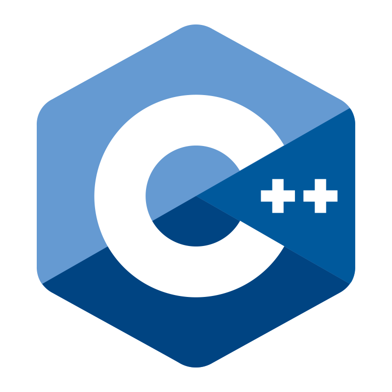
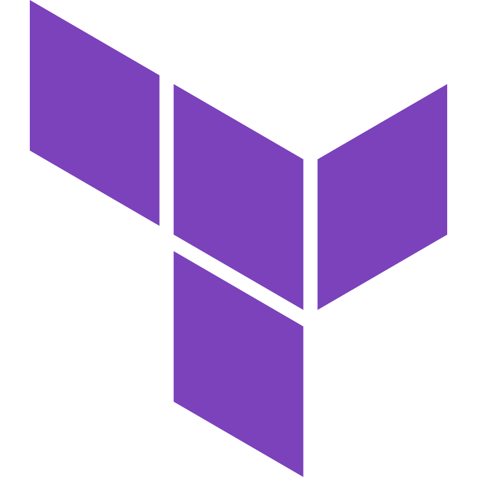

  

<h5 align="center"> 
  <code><a href="https://www.reddit.com/user/ikamii3" title="Reddit"> ikamii3</a></code>
</h5>

  <!-- 🔭 I’m currently working on  -->
  🌩️ DevOps 🌩️ 
  🌱 Currently learning <b>Go</b> 
  ☁️ Interested in everything about <b>Cloud</b> 
  🎮 Love to play <b>Video Games</b> 
  <!-- 👯 I’m looking to collaborate on ...   -->
  <!-- 🤔 I’m looking for help with ...   -->
  <!-- 💬 Ask me about ...   -->
  <!-- 📫 How to reach me: ...   -->

<h2 align="center">⚡️ Badges ⚡️</h2>

  

<h2 align="center">💻 Languages 💻</h2>
 
<!-- 

  <code></code>
  <code></code>
  <code></code>
  <code></code>

 -->

 
  <a href="https://github.com/ikamii">
<!--       -->
     
  </a> 

<!-- 
 -->
<h2 align="center">🛠️ Tools 🛠️</h2>
 
<!-- 

  <code></code>
  <code></code>
  <code></code>
  <code></code>
  <code></code>

 -->

 
   

<!-- 
 -->
<h2 align="center">🔥 Stats 🔥</h2>
 

  

    <!--  -->
    
    
  

           
  

    
  

   
   

  <!--  -->

 

<!-- 

<h2 align="center">⚡️ Social ⚡️</h2>  
<h5 align="center"> 
  <code><a href="https://www.reddit.com/user/ikamii3" title="Reddit"> Reddit</a></code>
</h5>

 -->

<h2 align="center">📚 Repositories 📚</h2>
 

  

      

      
<!-- <h4 align="center">
  <a href="https://github.com/ikamii?tab=repositories" title="Show Repositories">🔎 Show More 🔍</a>
</h4> -->

